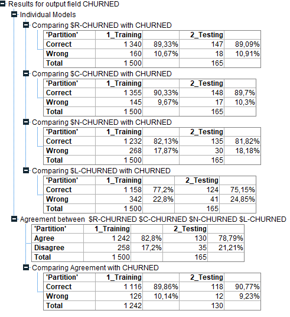
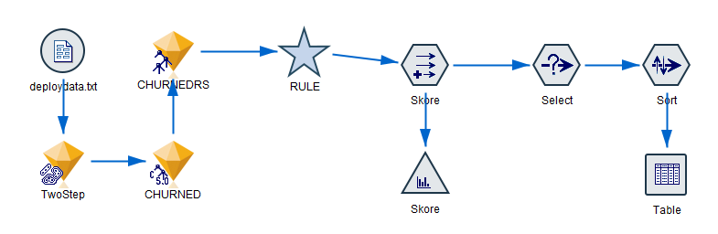
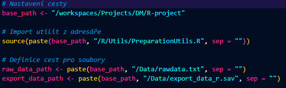
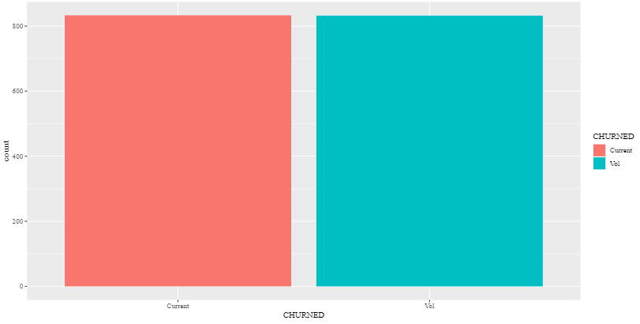
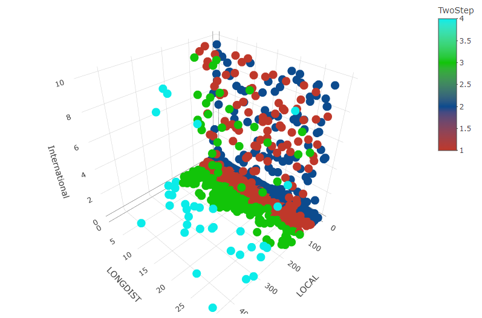
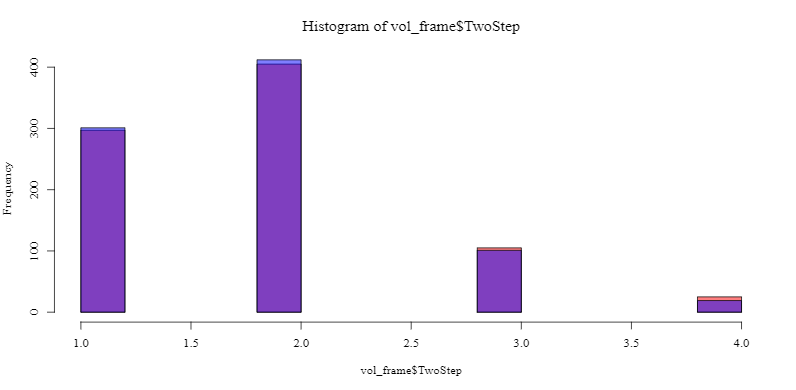
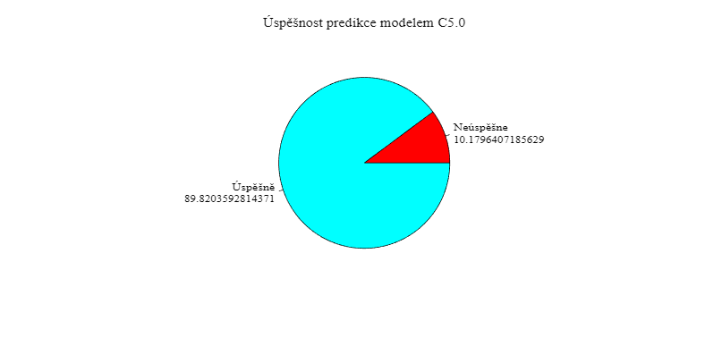
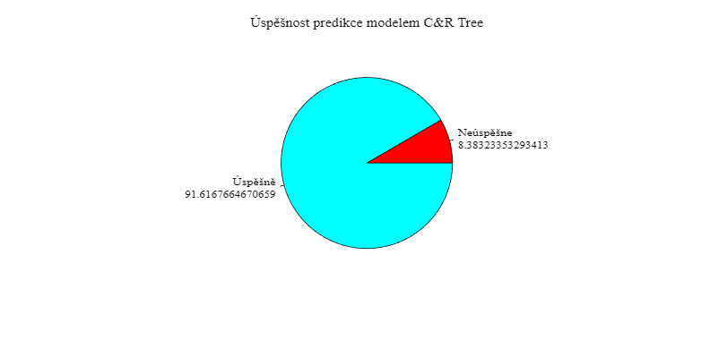
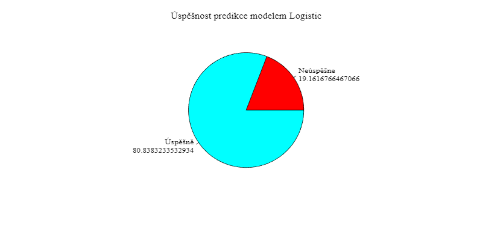
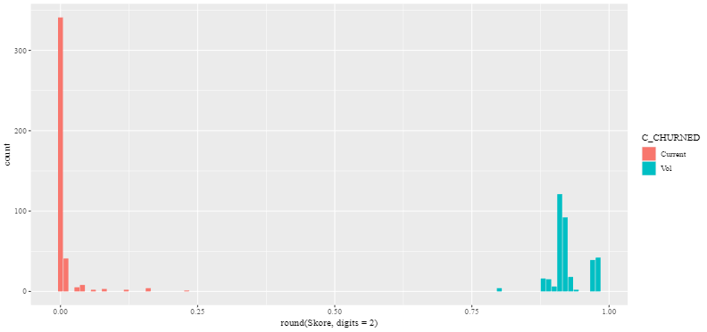

# **CHURN** - Migrace zákazníků ke konkurenci

## **Úvod**
CHURN migrace zákazníků ke konkurenci se týká situace, kdy zákazníci opouštějí danou firmu, produkt nebo službu a přecházejí k jejím konkurentům. Tento jev je důležitým faktorem pro podniky, protože představuje ztrátu tržního podílu a potenciálních příjmů.

Migrace zákazníků ke konkurenci může být způsobena různými faktory, jako je nedostatečná kvalita nebo výkon produktu, nedostatečný zákaznický servis, nepříznivé cenové podmínky, konkurenční nabídka nebo marketingové strategie konkurence, změny preferencí zákazníků nebo inovace na trhu. Je důležité, aby firmy pečlivě sledovaly a analyzovaly migraci svých zákazníků ke konkurenci, aby mohly identifikovat klíčové problémy a přijmout opatření k udržení zákazníků a zlepšení své konkurenceschopnosti.

Efektivní snižování migrace zákazníků ke konkurenci zahrnuje strategie udržení zákazníků, jako je zlepšování kvality produktů a služeb, zvýšení zákaznického servisu, konkurenční cenová politika, vytváření a posilování značky, poskytování výhodných nabídek a slev pro stávající zákazníky, a také aktivní sledování konkurenčního prostředí a rychlá reakce na změny na trhu.

Pochopení důvodů a faktorů, které ovlivňují migraci zákazníků ke konkurenci, je klíčové pro podniky, aby mohly optimalizovat své obchodní strategie a udržet si loajalitu zákazníků.

## **Struktura projektu**
<ol>
  <li>Úvod</li>
  <li>Příprava a instalace prostředí
    <ol>
      <li>Prostředí SPSS Modeler</li>
      <li>Instalace VSC + Docker</li>
    </ol>
  </li>
  <li>Rozbor struktury dat
    <ol>
      <li>Vstupních</li>
      <li>Výstupních</li>
    </ol>
  </li>
  <li>Vizualizace v Modeleru</li>
  <li>Implementace v jazyce R
    <ol>
      <li>Alternativní metody</li>
    </ol>
  </li>
  <li>Závěr</li>
</ol> 

## **Příprava a instalace prostředí**
1. Pro přípravu projektu je využíván IBM SPSS Modeler, [instalátor](https://www.ibm.com/spss)

2. Běhové prostředí, ve kterém poběží program v jazyce R, bude docker container. Je tedy nutné mít nainstalován Docker, [instalátor](https://www.docker.com/products/docker-desktop/)

3. Visual Studio Code je používán pro psaní zdrojových kódů jazyka R, [instalátor](https://code.visualstudio.com/download)

4. Do VSC je pořeba doinstalovat balíčky pro práci s dockerem a R jazykem<br>
  4.1 Docker, [více zde](https://marketplace.visualstudio.com/items?itemName=ms-azuretools.vscode-docker)<br>
  4.2 Remote Development, [více zde](https://marketplace.visualstudio.com/items?itemName=ms-vscode-remote.vscode-remote-extensionpack)<br>
  4.3 R + RDebugger, [více zde](https://marketplace.visualstudio.com/items?itemName=REditorSupport.r)

5. V konzoli ve složce s projektem otevřu VSCode příkazem:<br>
```code .```

6. Uvnitř VSCode otevřu menu pomocí klávesové zkratky **CTRL + SHIFT + P**<br>
  6.1 Vyberu **Add Dev Container Configuration Files..**<br>
  6.2 Jako image zvolím r-ver:4.2<br>
  6.3 Výsledný soubor [zde](.devcontainer/devcontainer.json)

7. Pro spuštění kontejneru a připojení se dovnitř provedu stisknutím klávesové zkratky **CTRL + SHIFT + P** a výběrem **Open Folder in Container...**

8. Po stažení, spuštění a připojení do devcontaineru je prostředí připraveno a nastaveno pro začátek programování v R.

## **Rozbor struktury dat**
Vstupní data jsou pro program zadána v textových souborech [rawdata](Data/rawdata.txt) a [deploydata](Data/deploydata.txt). Tyto soubory obsahují data oddělená "," a hlavičku popisující jednotlivé sloupce. Soubor rawdata je pouřit pro natrénování jednotlivých modelů a náslené otestování. Soubor deploydata (oproti rawdata nemá sloupec CHURNED) je využit k následné predikci modelem C5.0.

Zde je rozpis co který sloupec reprezentuje:
- **ID**: Id zákazníka (pro predikci z hlediska modelů je neptřebný)
- **LONGDIST**: Počet provolaných minut v meziměstských hovorech
- **International**: Počet provolaných minut v mezinárodních hovorech
- **LOCAL**: Počet provolaných minut v lokálních hovorech
- **DROPPED**: Počet típnutých/vymáčknutých hovorů
- **PAY_MTHD**: Způsob platby
- **LocalBillType**: Tarif pro místní volání
- **LongDistanceBillType**: Tarif pro meziměstské volání
- **AGE**: Věk uživatele
- **SEX**: Pohlaví uživatele
- **STATUS**: Stav uživatele
- **CHILDREN**: Počet dětí uživatele
- **Est_Income**: Příjem uživatele
- **Car_Owner**: Zda uživatel vlastní auto
- **No phone lines**: Žádné tel. číslo?
- **CHURNED**: Identifikátor odchodu ke konkurenci, (Current - stálý, Vol - přelétavý, InVol - neplatič)

## **Vizualizace v Modeleru**
Celý projekt je rozdělen do tří částí, které byly připraveny v prostředí SPSS Modeleru připraveny a sestaveny. Jednotlivé streamy jsou k dispozici ve složce [Models](Models). Tyto části dále odpovídají struktuře kódu v jazyce R

1. Celý projekt začíná přípravou dat. Ta je vymodelována v souboru [Preparation](Models/Preparation.str).

  1.1 Data jsou v prvním uzlu načtena z textového souboru [rawdata](Data/rawdata.txt)<br>
  1.2 Druhý uzel odebírá nepotřebný sloupec No.phone.lines<br>
  1.3 Třetí uzel provede filter na sloupcem CHURNED, kde jsou prázdné hodnoty/tedy ty co neznáme.<br>
  1.4 Čtvrtý uzel odebírá řádky jednotlivých "neplatičů"<br>
  1.5 Pátý uzel provede vyvážení dat podle hodnot ve sloupci CHURNED, tedy zduplikuje některé řádky<br>
  1.6 Tabulka "šmírovačka" - zobrazuje data po aktuálním uzlu<br>
  1.7 Šestý uzel Type nastavuje ID tak aby se dále nevyhodnocovalo a CHURNED jako cíl, který budeme hledat.<br>
  1.8 Poslední uzed vezne připravená data a uloží je do [Export_Vlastni](Data/Export_vlastni.sav) souboru

2. V druhém streamu [Modeling](Models/Modeling.str) je vizualizováno natrénování čtyř různých modelů na 90% množině a testování na 10% množině dat.

2.1 Připravené data z předchozího streamu jsou načtena.<br>
2.2 Uzlem Type specifikujeme ID jako none a CHURNED jako cíl.<br>
2.3 Data jsou algoritmem [TwoStep](https://dspace5.zcu.cz/handle/11025/10856) přiřazena do jednotlivých clusterů na základě vstupních prametrů: LONGDIST, International, LOCAL<br>
2.4 Následují body algoritmu TwoStep jsou grafová zobrazení.<br>
2.5 Směrem k učení jednotlivých modelů je uzel Partition, ten rozděluje data na 90% trénovacích a 10% testovacích dat.<br>
2.6 Prvním modelem, který trénujeme na datech je C5.0. [Více info zde](https://cran.r-project.org/web/packages/C50/vignettes/C5.0.html)<br>
2.7 Druhý model trénujeme algoritmem C&R Tree. [Více info zde](https://www.researchgate.net/figure/Classification-and-regression-tree-C-R-tree-Prognostic-modeling-was-performed-using_fig4_349922997)<br>
2.8 Následující dva algoritmy pracují pouze s numerickými hodnotami. Proto je nutné uzlem převést data na číselné hodnoty či je odebrat úplně.<br>
2.9 Třetí model trénujeme pomocí Logistické regrese. [Více info zde](https://cs.wikipedia.org/wiki/Logistick%C3%A1_regrese)<br>
2.10 Čtvrtý model je potom natrénován na neuronové síti. [Více info zde](https://en.wikipedia.org/wiki/Neural_network)<br>
2.11 Vygenerované natrénované modely (žluté diamanty) jsou následně sériově poskládány za sebe.
2.12 Poslední uzly obsahují analýzu testování na jednotlivých modelech a jejich graf. Analýza je zobrazena na následujícím obrázku.


3. Třetím a posledním streamem je soubor [Deployment](Models/Deployment.str), kde je aplikován model s algoritmem C5.0 na datech a vyhodnocení jednotivých zákazníků pomocí spočítaného skóre.

3.1 Nejdříve jsou načtena zadaná data ze souboru [deploydata](Data/deploydata.txt).<br>
3.2 Dále je vložen vygenerovaný model pro clusterizaci TwoStep. Ten přidá sloupec s přiřazeným clusterem.<br>
3.3 Následuje natrénovaný model algoritmem C5.0. Ten přidá predikovanou hodnotu a její procentualní pravděpodobnost.<br>
3.4 Následuje vygenerovaný set podmínek, který přiřadit podle setu podmínek taktéž predikovanou hodnotu a její pravděpodobnost úspěch (tonto krok je v R scriptu vynechán, jelikož se s ním dále nepracuje)<br>
3.5 Uzlem Skore, přidáme sloupec s hodnotou vypočítanou dle predikované hodnoty a její pravděpodobnosti. Tento parametr nám udává "spolehlivost" zákazníka. Skore je pořítáno následujícím vzorcem: Pokud predikovaná hodnot ja Vol tak (0.5 + 'pravdepodobnost' / 2) jinak (0.5 - 'pravdepodobnost' / 2)<br>
3.6 Uzlem select jsou vyfiltrovány pouze uživatele jejichž skóre je větší než 0.5.<br>
3.7 Následujícím uzlem Sort jsou záznamy seřazeny vzestupně podle přiděleného clusteru a sestupně podle skóre uživatele.<br>
3.8 Data jsou nakonec vypsána do tabulky.

## **Implementace v jazyce R**
Jednotlivé zdrojové kódy jsou umístěny ve složce [R](R). V kořenu této složky jsou umístěny 3 hlavní scripty. Ty reprezentují výše představené 3 streamy, příprava dat, modelovaní z dat a následné vyhodnocení na deploy datech. 

Aby se nemuselo kontrolovat zda jsou balíčky potřebné k běhu kódu nainstalovány, je k dispozici v adresáři [Utils](R/Utils/) soubor [install.R](R/Utils/Install.R). Spuštěním toho scriptu dojde k instalaci potřebných balíčku pro správný běh programu. Tento script stačí spusti pouze jednou a to po novém vytvoření kontejneru. Balíčky jsou instalovány lokálně pro daný kontejner. 

Každý hlavní soubor má k soubě vždy utilitu v adresáři Utils. Ta v rámci možností zjednodušuje strukturu a čitelnost hlavního programu. Obsahuje dodatečné funkce, které manipulijí s daty. Jednotlivé soubory mají vždy "Hlavičku", kde je nastavena základní cesta, odkazy na potřebné soubory a import její utility. Viz obrázek níže.


Hlavní tělo programu je přehledně odděleno a z 90% odpovídá jednotlivým krokům, vysvětleným již v části z modeleru. Jednotlivé řádky kódu jsou přímo v zdrojovém kódu v podobě komentářů. Proto se následující sekce bude spíše zaměřovat na dosažené výsledky než na funkčnost kódu.

### **Preparation.R** stream
Postup implementace je v podobě číslovaného seznamu sepsám přímo v [kódu](R/Preparation.R). 

Zde je seznam vypsaných kroků:
1. Načtu DATA a zobrazím view
2. Provedu FILTER nad sloupcem No.phone.lines a vykreslím view
3. Provedu SELECT na CHURN a vyberu pouze neprázdné hodnoty
4. Provedu SELECT na CHURN a odeberu neplatící zákazníky
5. Provedu BALANCE pro sloupec CHURN<br>
5.1 Určení maximálního počtu výskytů mezi hodnotami<br>
5.2 Inicializace prázdné tabulky pro vyvážená data<br>
5.3 Pro každou hodnotu ve sloupci<br>
5.4 Získání počtu výskytů této hodnoty<br>
5.5 Výpočet počtu potřebných nových řádků<br>
5.6 Výběr náhodných řádků s touto hodnotou pro duplikaci<br>
5.7 Přidání nových řádků do vyvážené tabulky<br>
5.8 Sloučení původní tabulky s vyváženou tabulkou<br>
5.9 Seřadím podle sloupce ID<br>
5.10 Zobrazím graf vyváženosti a tabulku s daty<br>
6. Převedu faktory na string a uložím výsledek do .sav souboru

Výsledkem je dataframe s vyváženými daty pro sloupec CHURNED. Ten je uložen jako export_data_r.sav. Viz graf vyváženosti:


### **Modeling.R** stream
Postup implementace je v podobě číslovaného seznamu sepsám přímo v [kódu](R/Modeling.R). 

Zde je seznam vypsaných kroků:
1. Načtu si vyexportovaná data<br>
1.1 Odeberu sloupec irelevantním ID
2. Vytvořím rozdělení pomocí clusterů (Alternativa TwoStep)<br>
2.1 Přiřadím výsledek jako sloupec k datům
3. Vykreslím 3D graf pro zařazení do clusterů

4. Vykreslím histogram pro clusterované hodnoty<br>
4.1 Hodnoty vztažené k "Vol" přelétavým zákazníkům<br>
4.2 Hodnoty vztažené k "Current" stálým zákazníkům

5. PARTITION - Rozdělím data na trénovací a testovací<br>
5.1 Náhodně zamícháme řádky v dataframe<br>
5.2 Rozdělení 90% trénovací data a 10%<br>
5.3 Nakopíruju si testovací tabulku
6. Predikce algoritmem C5.0<br>
6.1 Připravým trénovací data a oddělím cílový sloupec<br>
6.2 Provedu natrénování modelu<br>
6.3 Připravým testovací data a oddělím cílový sloupec<br>
6.4 Predikce na testovacích datech<br>
6.5 Vyhodnocení výsledků v podobě koláčového grafu

7. Predikce algoritmem C&R Tree<br>
7.1 Provedu natrénování modelu<br>
7.2 Predikce na testovacích datech<br>
7.3 Uložím výsledky do originální tabulky<br>
7.3 Výpis výsledků predikce

8. Predikce algoritmem Logistic<br>
8.1 Převod na numerická data<br>
8.2 Rozložení testovacích dat a slouspe s výsledkem<br>
8.3 Provedu natrénování modelu<br>
8.4 Predikce na testovacích datech a převod výsledků do 0 a 1<br>
8.5 Uložím výsledky do originální tabulky a převedu z5 do textu<br>
8.6 Výpis výsledků predikce

9. Predikce algoritmem Neuronová síť<br>
9.1 Provedu natrénování modelu<br>
9.2 Predikce na testovacích datech a převod výsledků do 0 a 1<br>
9.3 Uložím výsledky do originální tabulky a převedu z5 do textu<br>
9.4 Výpis výsledků predikce

10 Výpis celkové tabulky a predikovaných hodnot

### **Deployment.R** stream
Postup implementace je v podobě číslovaného seznamu sepsám přímo v [kódu](R/Deployment.R). 

Zde je seznam vypsaných kroků:
1. Načtu DATA<br>
1.1 Odstraním ID a No.phone.lines
2. Vytvořím rozdělení pomocí clusterů (Alternativa TwoStep)<br>
2.1 Přiřadím výsledek k datům
3. Provedu predikci na základě modelu C5.0<br>
3.1 Přiřadím k datům původní tabulky
4. Do tabulky uložím i procentuální hodnotu<br>
4.1 Dva sloupce pro Vol i pro Current a zajímá mě ta predikovaná, max
5. Do tabulky přidám vypočítanou hodnotu skóre
6. Vykreslím graf pro rozložení skóre

7. Vyfiltruji řádky, které mají skóre větší než 0.5
8. Doplní pole řádků zpátky ID, abych věděl čí je co
9. Seřadím data vzestupně podle clusteru a sestupně podle Skore
10. Vypíšu vyhodnocená data

## **Závěr**
Migrace zákazníků ke konkurenci byl zaměřen na analýzu a predikci odchodu zákazníků a jejich migrace ke konkurenčním společnostem. Cílem projektu bylo identifikovat klíčové faktory a chování zákazníků, které přispívají k odchodu, a vytvořit modely pro predikci budoucího chování zákazníků.

V rámci projektu byly použity různé algoritmy a techniky analýzy dat, včetně TwoStep clustering, C5.0, C&R Tree a Logistic regression. Tyto algoritmy umožnily identifikovat shluky zákazníků, vyhodnotit jejich charakteristiky a predikovat pravděpodobnost odchodu zákazníků ke konkurenci.

Během projektu byly také provedeny vizualizace dat, které umožnily lepší porozumění distribuci a vztahům mezi proměnnými. Dále byly vyhodnoceny výsledky predikcí a úspěšnost modelů. Výsledkem projektu byl také výpočet skóre pro jednotlivé zákazníky, které odráželo jejich pravděpodobnost migrace ke konkurenci.