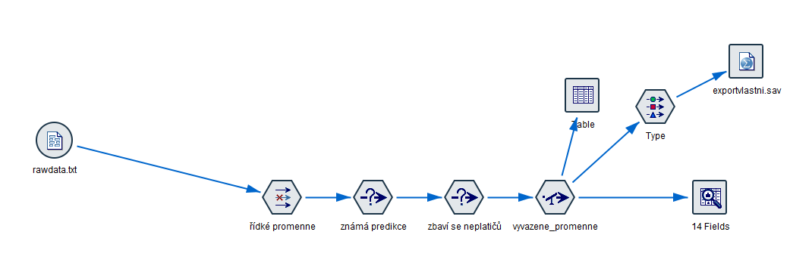
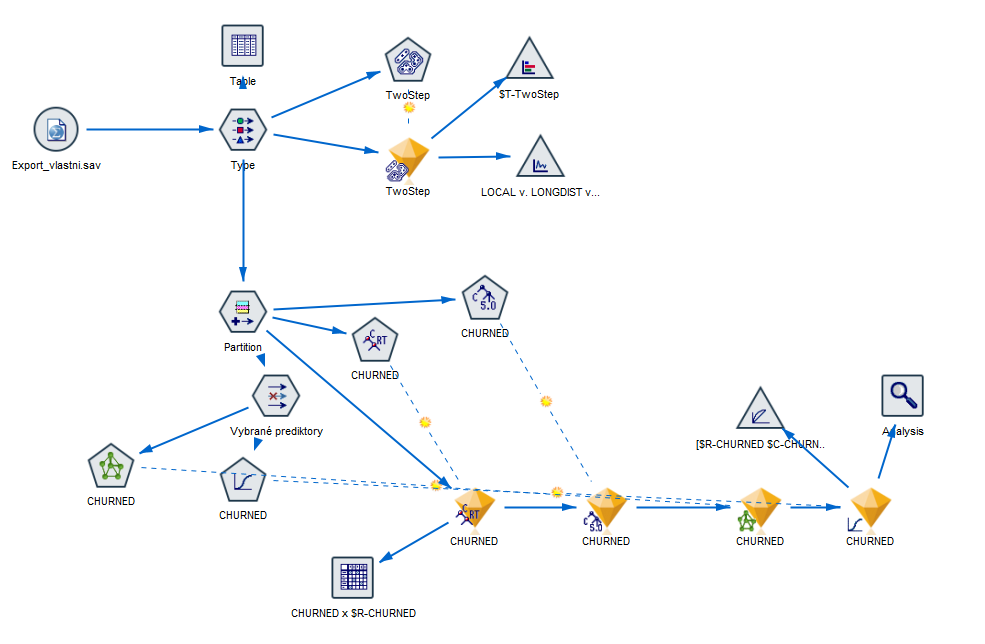

# **CHURN** - Migrace zákazníků ke konkurenci

## **Úvod**
CHURN migrace zákazníků ke konkurenci se týká situace, kdy zákazníci opouštějí danou firmu, produkt nebo službu a přecházejí k jejím konkurentům. Tento jev je důležitým faktorem pro podniky, protože představuje ztrátu tržního podílu a potenciálních příjmů.

Migrace zákazníků ke konkurenci může být způsobena různými faktory, jako je nedostatečná kvalita nebo výkon produktu, nedostatečný zákaznický servis, nepříznivé cenové podmínky, konkurenční nabídka nebo marketingové strategie konkurence, změny preferencí zákazníků nebo inovace na trhu. Je důležité, aby firmy pečlivě sledovaly a analyzovaly migraci svých zákazníků ke konkurenci, aby mohly identifikovat klíčové problémy a přijmout opatření k udržení zákazníků a zlepšení své konkurenceschopnosti.

Efektivní snižování migrace zákazníků ke konkurenci zahrnuje strategie udržení zákazníků, jako je zlepšování kvality produktů a služeb, zvýšení zákaznického servisu, konkurenční cenová politika, vytváření a posilování značky, poskytování výhodných nabídek a slev pro stávající zákazníky, a také aktivní sledování konkurenčního prostředí a rychlá reakce na změny na trhu.

Pochopení důvodů a faktorů, které ovlivňují migraci zákazníků ke konkurenci, je klíčové pro podniky, aby mohly optimalizovat své obchodní strategie a udržet si loajalitu zákazníků.

## **Struktura projektu**
<ol>
  <li>Úvod</li>
  <li>Příprava a instalace prostředí
    <ol>
      <li>Prostředí SPSS Modeler</li>
      <li>Instalace VSC + Docker</li>
    </ol>
  </li>
  <li>Vizualizace v Modeleru</li>
  <li>Rozbor struktury dat
    <ol>
      <li>Vstupních</li>
      <li>Výstupních</li>
    </ol>
  </li>
  <li>Implementace v jazyce R
    <ol>
      <li>Alternativní metody</li>
    </ol>
  </li>
  <li>Závěr</li>
</ol> 

## **Příprava a instalace prostředí**
1. Pro přípravu projektu je využíván IBM SPSS Modeler, [instalátor](https://www.ibm.com/spss)

2. Běhové prostředí, ve kterém poběží program v jazyce R, bude docker container. Je tedy nutné mít nainstalován Docker, [instalátor](https://www.docker.com/products/docker-desktop/)

3. Visual Studio Code je používán pro psaní zdrojových kódů jazyka R, [instalátor](https://code.visualstudio.com/download)

4. Do VSC je pořeba doinstalovat balíčky pro práci s dockerem a R jazykem<br>
  4.1 Docker, [více zde](https://marketplace.visualstudio.com/items?itemName=ms-azuretools.vscode-docker)<br>
  4.2 Remote Development, [více zde](https://marketplace.visualstudio.com/items?itemName=ms-vscode-remote.vscode-remote-extensionpack)<br>
  4.3 R + RDebugger, [více zde](https://marketplace.visualstudio.com/items?itemName=REditorSupport.r)

5. V konzoli ve složce s projektem otevřu VSCode příkazem:<br>
```code .```

6. Uvnitř VSCode otevřu menu pomocí klávesové zkratky **CTRL + SHIFT + P**<br>
  6.1 Vyberu **Add Dev Container Configuration Files..**<br>
  6.2 Jako image zvolím r-ver:4.2<br>
  6.3 Výsledný soubor [zde](.devcontainer/devcontainer.json)

7. Pro spuštění kontejneru a připojení se dovnitř provedu stisknutím klávesové zkratky **CTRL + SHIFT + P** a výběrem **Open Folder in Container...**

8. Po stažení, spuštění a připojení do devcontaineru je prostředí připraveno a nastaveno pro začátek programování v R.

## **Vizualizace v Modeleru**
Celý projekt je rozdělen do tří částí, které byly připraveny v prostředí SPSS Modeleru připraveny a sestaveny. Jednotlivé streamy jsou k dispozici ve složce [Models](Models). Tyto části dále odpovídají struktuře kódu v jazyce R

1. Celý projekt začíná přípravou dat. Ta je vymodelována v souboru [Preparation](Models/Preparation.str).

  1.1 Data jsou v prvním uzlu načtena z textového souboru [rawdata](Data/rawdata.txt)<br>
  1.2 Druhý uzel odebírá nepotřebný sloupec No.phone.lines<br>
  1.3 Třetí uzel provede filter na sloupcem CHURNED, kde jsou prázdné hodnoty/tedy ty co neznáme.<br>
  1.4 Čtvrtý uzel odebírá řádky jednotlivých "neplatičů"<br>
  1.5 Pátý uzel provede vyvážení dat podle hodnot ve sloupci CHURNED, tedy zduplikuje některé řádky<br>
  1.6 Tabulka "šmírovačka" - zobrazuje data po aktuálním uzlu<br>
  1.7 Šestý uzel Type nastavuje ID tak aby se dále nevyhodnocovalo a CHURNED jako cíl, který budeme hledat.<br>
  1.8 Poslední uzed vezne připravená data a uloží je do [Export_Vlastni](Data/Export_vlastni.sav) souboru

2. V druhém streamu [Modeling](Models/Modeling.str) je vizualizováno natrénování čtyř různých modelů na 90% množině a testování na 10% množině dat.



